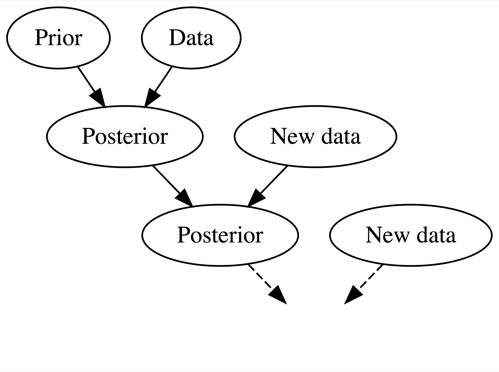

class: middle center

```{r echo=FALSE, message=FALSE}
library(tidyverse)
library(bayesrules)
library(rstanarm)
library(bayesplot)
theme_set(theme_gray(base_size = 18))
```


        

.large[`r fontawesome::fa(name = "twitter")`] <a href = "http://twitter.com/MineDogucu">MineDogucu</a>  
.large[`r fontawesome::fa(name = "github")`] <a href = "http://github.com/mdogucu">mdogucu</a>  
.large[`r fontawesome::fa(name = "link")`] <a href = "http://minedogucu.com">minedogucu.com</a>


---

.center[

.pull-left[


        
[`r fontawesome::fa(name = "github")`](https://github.com/ics80-wi21)[`r fontawesome::fa(name = "link")`](https://introdata.science)


[`r fontawesome::fa(name = "github")`](https://github.com/stats68-sp21)[`r fontawesome::fa(name = "link")`](https://stats68-sp21.netlify.app/)

]
]

.center[

.pull-right[


[`r fontawesome::fa(name = "github")`](https://github.com/stats295r-fa20)[`r fontawesome::fa(name = "link")`](https://www.scicompr.com/)


[`r fontawesome::fa(name = "github")`](https://github.com/mdogucu/stats67-su20-website)[`r fontawesome::fa(name = "link")`](https://www.stats4cs.com/)

]

]
---

class: center middle 


[`r fontawesome::fa(name = "github")`](https://github.com/mdogucu/stats115-wi21-website)[`r fontawesome::fa(name = "link")`](https://www.stats115.com/)

---

class: center middle

.font-75[Background]

---


### Bayes Rules! An Introduction to Bayesian Modeling with R

.center[


[`r fontawesome::fa(name = "link")`bayesrulesbook.com](https://www.bayesrulesbook.com/)
]

.pull-left[
.center[

 


Alicia Johnson          
.font-20[Macalester College]
        
[`r fontawesome::fa(name = "link")`](https://ajohns24.github.io/portfolio)
[`r fontawesome::fa(name = "github")`](https://github.com/ajohns24)

]
]

.pull-right[
.center[


Miles Ott  
.font-20[Smith College]

[`r fontawesome::fa(name = "link")`](https://milesott.com/)
[`r fontawesome::fa(name = "github")`](https://github.com/MilesOtt)
[`r fontawesome::fa(name = "twitter")`](https://twitter.com/Miles_Ott)

]
]

--
.pull-left[.footnote[All the examples in this talk are from Johnson, Ott & Dogucu (forthcoming) unless otherwise noted.]]


---

class: middle

```{r echo=FALSE, fig.align='center', out.width="50%"}

```

---

class: middle 

## Historical changes

- Advances in computing

--

- Departure from tradition

--

- Reevaluation of subjectivity

---

class: middle

### State of Bayesian Education at the Undergraduate Level

--

- 7 courses / 50 liberal arts colleges

- 47 courses / 102 universities

--

Major examples: Statistics, Mathematics, Data Science, Computer Science, Actuarial Science, Cognitive Science, Economics, Geological and Planetary Sciences, Philosophy, Physics, Psychology, Political Science.  

--

Required courses: Duke (Statistical Science), UC Irvine (Data Science), Ohio State (Data Analytics), Virginia Tech (Statistics)


.reference[(Dogucu & Hu, forthcoming)]

---

class: center middle

.font-75[STATS 115]

---

class: middle

### Students' Background

Prerequisite: STATS 120C. Introduction to Probability and Statistics III

Recommended: STATS 110. Statistical Methods for Data Analysis I

--

In practice: most of the enrolled students are Data Science majors thus take more statistics and computing courses.

---

class: middle

Fall 2017 (before UCI, graduate)  
Winter 2020 (in person)  
Summer 2020 II (virtual)  
Winter 2021 (virtual)  

---

class: middle

### Overview

Weeks 1 - 4, Bayesian Foundations (Unit 1)

--

<hr>


Weeks 5 - 7, Posterior Simulation and Analysis (Unit 2)

--

<hr>

Week 8 - 10, Bayesian Regression and Classification (Unit 3)

--

<hr> 

Not covered in STATS 115, Hierarchical Bayesian Models (Unit 4)

---

class: center middle

.font-75[Bayesian Foundations]


---

class: middle

(1) Zuofu claims that he can predict the outcome of a coin flip. To test his claim, you flip a fair coin 10 times and he correctly predicts all 10! (2) Kavya claims that she can distinguish natural and artificial sweeteners. To test her claim, you give her 10 sweetener samples and she correctly identifies each! In light of these experiments, what do you conclude?

a. You’re more confident in Kavya’s claim than Zuofu’s claim.  
b. The evidence supporting Zuofu’s claim is just as strong as the evidence supporting Kavya’s claim.


---

class: middle

Suppose that during a recent doctor’s visit, you tested positive for a very rare disease. If you only get to ask the doctor one question, which would it be?

a. What’s the chance that I actually have the disease?  
b. If in fact I don’t have the disease, what’s the chance that I would’ve gotten this positive test result?

---
class: middle

## Bayesian Foundations

- Bayes' Rule
- The Beta-Binomial Model
- Balance and Sequentially in Bayesian Analysis
- Conjugate families

---

class: middle

## Example

Bechdel test for movies

- the movie has to have at least two women in it;
- these two women talk to each other; and
- they talk about something besides a man.

--

Let $\pi$ represent the number of movies that pass the Bechdel test.

--

```{r echo=FALSE, fig.align='center', fig.height=3}
plot_beta(5,11) 
```


---

```{r, echo=FALSE, message=FALSE}
## Remove
## Code for facet_wrapped Beta-Binomial plots
### Plotting function
beta_binom_grid_plot <- function(data, likelihood = FALSE, posterior = FALSE){
  g <- ggplot(data, aes(x = pi, y = prior)) + 
    geom_line() + 
    geom_area(alpha = 0.5, aes(fill = "prior", x = pi, y = prior)) + 
    scale_fill_manual("", values = c(prior = "#f0e442", 
      `(scaled) likelihood` = "#0071b2", posterior = "#009e74"), breaks = c("prior", "(scaled) likelihood", "posterior")) + 
    labs(x = expression(pi), y = "density") + 
    theme(legend.position="bottom")
  
  if(likelihood == TRUE){
    g <- g + 
      geom_line(aes(x = pi, y = likelihood)) + 
      geom_area(alpha = 0.5, aes(fill = "(scaled) likelihood", x = pi, y = likelihood))
  }
  
  if(posterior == TRUE){
    g <- g + 
      geom_line(aes(x = pi, y = posterior)) + 
      geom_area(alpha = 0.5, aes(fill = "posterior", x = pi, y = posterior)) 
  }
  g
}
make_plot_data <- function(as, bs, xs, ns, labs_prior, labs_likelihood){
  ### Set up data to call in plot
  # Refinement parameter
  size <- 250
  
  # Model settings
  pi <- rep(seq(0,1,length=size), 9)
  
  # Prior parameters
  a <- rep(as, each = size*3)
  b <- rep(bs, each = size*3)
  # Data
  x <- rep(rep(xs, each = size), 3)
  n <- rep(rep(ns, each = size), 3)
  # Posterior parameters
  a_post <- x + a
  b_post <- n - x + b
  # Labels
  setting_prior      <- as.factor(rep(1:3, each = size*3))
  setting_likelihood <- as.factor(rep(rep(1:3, each = size), 3))
  levels(setting_prior)      <- labs_prior
  levels(setting_likelihood) <- labs_likelihood    
  # Prior, likelihood, posterior functions
  bfun1 <- function(x){dbinom(x = xs[1], size = ns[1], prob = x)}
  bfun2 <- function(x){dbinom(x = xs[2], size = ns[2], prob = x)}
  bfun3 <- function(x){dbinom(x = xs[3], size = ns[3], prob = x)}
  scale   <- rep(rep(c(integrate(bfun1, 0, 1)[[1]], integrate(bfun2, 0, 1)[[1]], integrate(bfun3, 0, 1)[[1]]), each = size), 3)
  prior      <- dbeta(x = pi, shape1 = a, shape2 = b)
  likelihood <- dbinom(x = x, size = n, prob = pi) / scale
  posterior  <- dbeta(x = pi, shape1 = a_post, shape2 = b_post)
  # Combine into data frame
  data.frame(setting_prior, setting_likelihood, pi, a, b, x, n, likelihood, prior, posterior)
}
plot_dat <- make_plot_data(
  as = c(5,1,14), bs = c(11,1,1), 
  xs = c(6,29,46), ns = c(13,63,99), 
  labs_prior = c("prior: Beta(5,11)", "prior: Beta(1,1)", "prior: Beta(14,1)"), 
  labs_likelihood = c("data: Y = 6 of n = 13", "data: Y = 29 of n = 63", "data: Y = 46 of n = 99"))
```


```{r echo = FALSE, fig.align='center'}
plot_dat_new <- plot_dat %>% 
  mutate(setting_prior = factor(setting_prior, 
                                levels = c("prior: Beta(14,1)", "prior: Beta(5,11)", "prior: Beta(1,1)")))
beta_binom_grid_plot(plot_dat_new, posterior = TRUE, likelihood = TRUE) + 
  facet_grid(setting_prior ~ setting_likelihood) +
  theme(text = element_text(size=17)) 
```


---
class: center middle

.font-75[Posterior Simulation and Analysis]

---

class: middle

## Posterior Simulation and Analysis

- Approximating the Posterior 
- Hypothesis Testing
- Credible Intervals
- Posterior Prediction

---

class: middle

```{r}
one_mh_iteration <- function(w, current){
 # STEP 1: Propose the next chain location
 proposal <- runif(1, min = current - w, max = current + w)
  
 # STEP 2: Decide whether or not to go there
 proposal_plaus <- dnorm(proposal, 0, 1) * dnorm(6.25, proposal, 0.75)
 current_plaus  <- dnorm(current, 0, 1) * dnorm(6.25, current, 0.75)
 alpha <- min(1, proposal_plaus / current_plaus)
 next_stop <- sample(c(proposal, current), 
  size = 1, prob = c(alpha, 1-alpha))
  
 # Return the results
 return(data.frame(proposal, alpha, next_stop))
}
```

---


```{r}
mh_tour <- function(N, w){
  # 1. Start the chain at location 3
  current <- 3

  # 2. Initialize the simulation
  mu <- rep(0, N)

  # 3. Simulate N Markov chain stops
  for(i in 1:N){    
    # Simulate one iteration
    sim <- one_mh_iteration(w = w, current = current)
    
    # Record next location
    mu[i] <- sim$next_stop
    
    # Reset the current location
    current <- sim$next_stop
  }
  
  # 4. Return the chain locations
  return(data.frame(iteration = c(1:N), mu))
}
```

---

```{r cache=TRUE}
set.seed(84735)
mh_simulation_1 <- mh_tour(N = 5000, w = 1)
```

.pull-left[
```{r echo=FALSE}
ggplot(mh_simulation_1, aes(x = mu)) + 
  geom_histogram(aes(y = ..density..), color = "white", bins = 20) + 
  stat_function(fun = dnorm, args = list(4,0.6), color = "red")
```
]

.pull-right[
```{r echo=FALSE}
ggplot(mh_simulation_1, aes(x = iteration, y = mu)) + 
  geom_line()
```
]

---
class: center middle

.font-75[Bayesian Regression and Classification]

---

class: middle

- Normal regression
- Logistic regression
- Poisson and negative binomial regression
- Naive Bayes classification
- Model evaluation, and posterior prediction

---

class: center middle

.font-75[R packages]


---

class: middle center

.large[`r fontawesome::fa(name = "github")`] <a href = "http://github.com/dogucu/bayesrules">library(bayesrules)</a> 

```{r eval=FALSE}
devtools::install_github("mdogucu/bayesrules")
```

---

.pull-left[
```{r fig.align='center'}
plot_beta(alpha = 3, beta = 8)
```

]

.pull-right[

```{r fig.align='center'}
plot_beta(alpha = 10, beta = 2)
```

]
---
 
```{r fig.align='center'}
plot_beta_binomial(alpha = 3, beta = 8, y = 19, n = 20)
```

---

class: middle

```{r echo=FALSE, cache=TRUE}
normal_model_sim <- stan_glm(
  rides ~ temp_feel, data = bikes, 
  family = gaussian, 
  chains = 4, iter = 5000*2, seed = 84735, refresh = 0)
normal_model_df <- as.data.frame(normal_model_sim)
set.seed(84735)
predict_75 <- normal_model_df %>% 
  mutate(y_trend = `(Intercept)` + temp_feel*75) %>%
  mutate(y_new = rnorm(20000, y_trend, sigma))
```

```{r echo=FALSE, cache=TRUE}
set.seed(84735)
predictions <- posterior_predict(normal_model_sim, 
  newdata = bikes)
```

```{r}
prediction_summary(y = bikes$rides, yrep = predictions)
```

---

class: middle

## `library(rstan)`


.pull-left[
```{r}
# STEP 1: DEFINE the model
stan_bike_model <- "
  data {
    int<lower=0> n;
    vector[n] Y;
    vector[n] X;
  }
  parameters {
    real beta0;
    real beta1;
    real<lower=0> sigma;
  }
  model {
    Y ~ normal(beta0 + beta1 * X, sigma);
  }
"
```

]


.pull-right[

```{r eval=FALSE}
# STEP 2: SIMULATE the posterior
stan_bike_sim <- 
  stan(model_code = stan_bike_model, 
  data = list(n = nrow(bikes), 
              Y = bikes$rides, X = bikes$temp_feel), 
  chains = 4, iter = 5000*2, seed = 84735)
```

]

---

class: middle

## `library(rstanarm)`


```{r eval=FALSE}
normal_model_sim <- stan_glm(rides ~ temp_feel, 
                             data = bikes, 
                             family = gaussian, 
                             chains = 4, iter = 5000*2,
                             seed = 84735)
```

```{r cache=TRUE, echo=FALSE}
normal_model_sim <- 
  stan_glm(rides ~ temp_feel, 
           data = bikes, 
           family = gaussian, 
           chains = 4, iter = 5000*2,
           seed = 84735,
           refresh = FALSE)
```

---

### `library(bayesplot)`

.pull-left[
```{r out.width = "80%", fig.align='center'}
mcmc_trace(normal_model_sim, size = 0.1)
```

]

.pull-right[

```{r out.width = "80%", fig.align='center'}
mcmc_dens_overlay(normal_model_sim)
```
]

---

### `library(bayesplot)`


```{r cache=TRUE, fig.align='center', out.width="30%"}
ppc_intervals(bikes$rides, yrep = predictions, 
  x = bikes$temp_feel, 
  prob = 0.5, prob_outer = 0.95)
```

---

class: middle

## Assessment

- Quizzes
- Homework
- Project
- Exams (midterm and final)

---

class: middle

## Pedagogical Approach

- Checking intuition 

--

- Active learning (quizzes and applications)

--

- Computing & math together

--

- Compute for a single case, then use built-in functions

---

class: middle

## Accessibility and Inclusion

- Open-Access

--

- Visual access (color-palette and alternate text)

--

- Citations

--

- Datasets

More on the topic is available on [DataPedagogy blog](https://www.datapedagogy.com/#category:Bayes_Rules!_book).
---

class: middle

- [Undergraduate Bayesian Education Resources](https://undergrad-bayes.netlify.app/)

--

- [Undergraduate Bayesian Education Network](https://undergrad-bayes.netlify.app/network.html)

--

- [USCOTS workshop](https://www.causeweb.org/cause/uscots/uscots21/workshop/4)

---

class: middle center

Questions?

[bit.ly/dogucu-talks](https://bit.ly/dogucu-talks)
