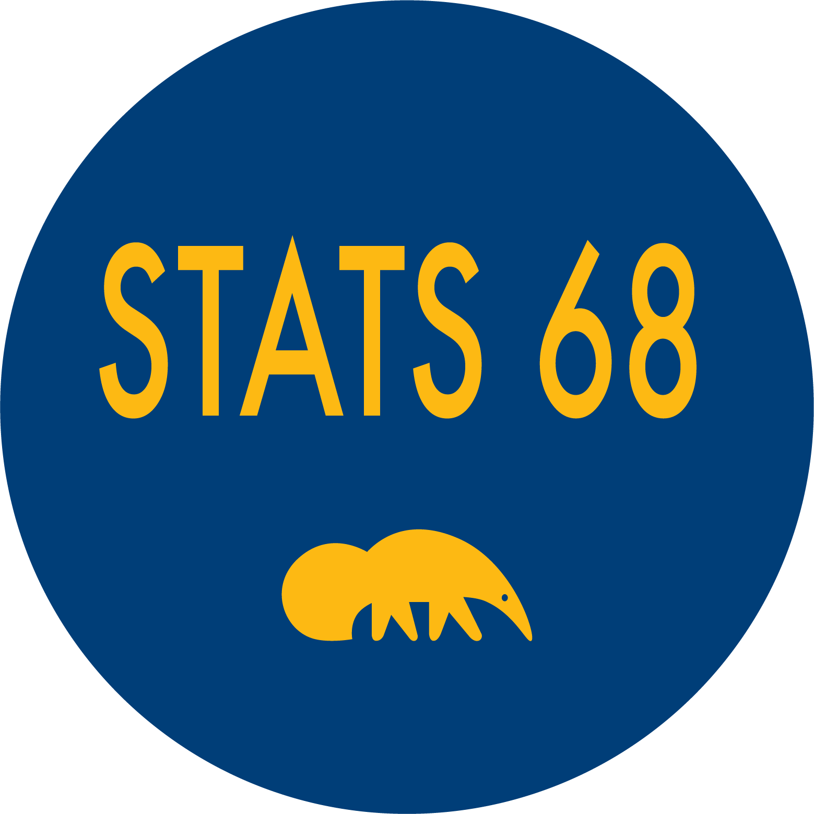

class: middle center

```{r echo=FALSE}
library(ggplot2)
library(bayesrules)
theme_set(theme_gray(base_size = 18))
```


        

.large[`r fontawesome::fa(name = "twitter")`] <a href = "http://twitter.com/MineDogucu">MineDogucu</a>  
.large[`r fontawesome::fa(name = "github")`] <a href = "http://github.com/mdogucu">mdogucu</a>  
.large[`r fontawesome::fa(name = "link")`] <a href = "http://minedogucu.com">minedogucu.com</a>


---

.center[

.pull-left[


        
[`r fontawesome::fa(name = "github")`](https://github.com/ics80-wi21)[`r fontawesome::fa(name = "link")`](https://introdata.science)



[`r fontawesome::fa(name = "github")`](https://github.com/stats68-sp21)[`r fontawesome::fa(name = "link")`](https://stats68-sp21.netlify.app/)

]
]

.center[

.pull-right[


[`r fontawesome::fa(name = "github")`](https://github.com/stats295r-fa20)[`r fontawesome::fa(name = "link")`](https://www.scicompr.com/)


[`r fontawesome::fa(name = "github")`](https://github.com/mdogucu/stats67-su20-website)[`r fontawesome::fa(name = "link")`](https://www.stats4cs.com/)

]

]
---

class: center middle 


[`r fontawesome::fa(name = "github")`](https://github.com/mdogucu/stats115-wi21-website)[`r fontawesome::fa(name = "link")`](https://www.stats115.com/)

---

### Bayes Rules! An Introduction to Bayesian Modeling with R

.center[


[`r fontawesome::fa(name = "link")`bayesrulesbook.com](https://www.bayesrulesbook.com/)
]

.pull-left[
.center[

 

        
Macalester College
        
[`r fontawesome::fa(name = "link")`](https://ajohns24.github.io/portfolio)
[`r fontawesome::fa(name = "github")`](https://github.com/ajohns24)

]
]

.pull-right[
.center[

        
Smith College

[`r fontawesome::fa(name = "link")`](https://milesott.com/)
[`r fontawesome::fa(name = "github")`](https://github.com/MilesOtt)
[`r fontawesome::fa(name = "twitter")`](https://twitter.com/Miles_Ott)

]
]

---

### Bayesian ideas pre-college

- cite Kazak
- cite the updating ideas
- 

---

### Why a Bayesian Course in College?

---

### State of Bayesian Education at the Undergraduate Level

---

### Prerequisites

---

class: middle

### Overview

Weeks 1 - 4, Bayesian Foundations (Unit 1)

--

<hr>


Weeks 5 - 7, Posterior Simulation and Analysis (Unit 2)

--
<hr>

Week 8 - 10, Bayesian Regression and Classification (Unit 3)

--

<hr> 

Not covered in STATS 115, Hierarchical Bayesian Models (Unit 4)

---
class: middle center

.large[`r fontawesome::fa(name = "github")`] <a href = "http://github.com/dogucu/bayesrules">library(bayesrules)</a> 

```{r eval=FALSE}
devtools::install_github("mdogucu/bayesrules")
```

---

.pull-left[
```{r fig.align='center'}
plot_beta(alpha = 3, beta = 8)
```

]

.pull-right[

```{r fig.align='center'}
plot_beta(alpha = 10, beta = 2)
```

]
---
 
```{r fig.align='center'}
plot_beta_binomial(alpha = 3, beta = 8, y = 19, n = 20)
```

---

## Assessment

---


## Accessibility and Inclusion

---

## Resources

GitHub repo

[USCOTS workshop](https://www.causeweb.org/cause/uscots/uscots21)
